<p align="middle" >
  
</p>
<p align="middle"><strong>aicheck는 가족 안심 자녀 금융 지원 서비스 입니다.</strong></p>

## 프로젝트 소개
- 기록 기능을 넘어, 자녀의 소비 행동을 분석하고 학습 기회를 제공합니다
- AI가 실시간 피드백을 통해 소비 습관 개선을 유도합니다
- 보이스피싱 및 스미싱 탐지를 통해 가족의 디지털 보안을 강화합니다
- 금융 교육과 실생활 보안을 함께 고려한 가정용 AI 시스템입니다


## 영상 포트폴리오
[](https://www.youtube.com/watch?v=pnFKBppBN68)

## ✨ 주요 기능

### 기능 1. 자녀의 건강한 금융 생활

#### 용돈 리포트

- 월별/카테고리별 지출 패턴 시각화
- 부모의 정기 용돈 지급 판단 기준 제공


#### 자동 용돈 기입장

- 수입/지출 발생 시 자동 금액 입력
- 자녀는 상세 내용만 작성하면 되는 **간편한 기록 환경 제공**

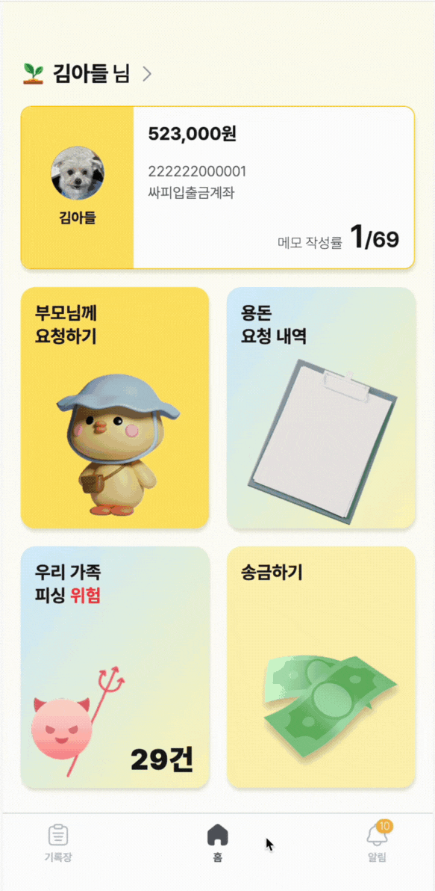

#### 용돈 협상 AI (엄마 AI)

- **살까 말까?**: 소비 패턴을 분석해 충동구매 여부에 대해 조언
- **추가 용돈 요청**: AI에게 설득 → 성공 시 부모에게 용돈 인상 요청 메시지(대화 요약) 전송, 실패 시 ‘거절’ 피드백 제공
- 설득 기준, 용돈 한도, 대화 스타일 등은 **부모가 자유롭게 커스터마이징 가능**

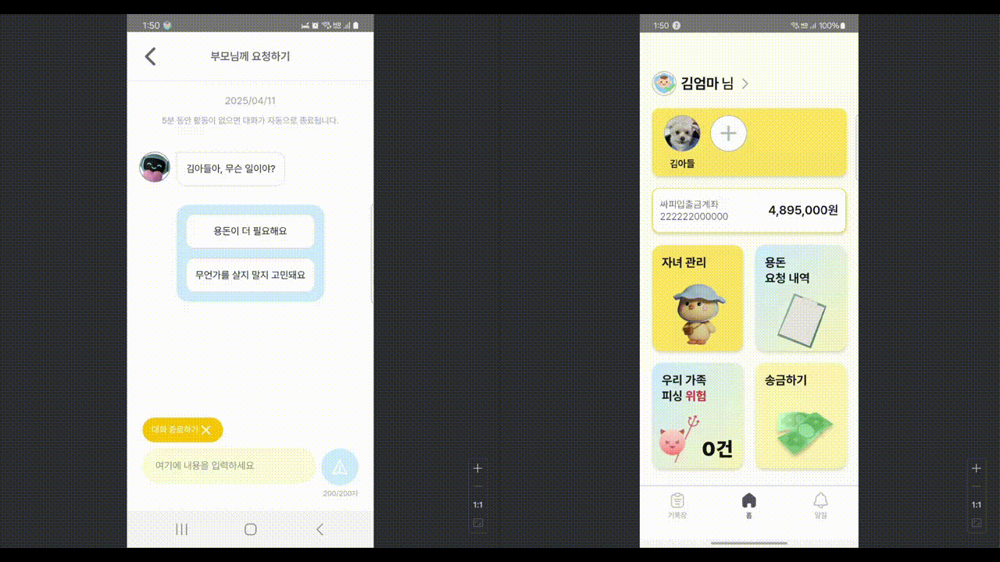

### 기능 2. 자녀의 걱정 없는 금융 생활

#### 보이스피싱 탐지

- 통화 발생 시 자동 녹음 시작
- 딥페이크 음성 + 통화 스크립트 기반 AI 분석
- 의심 정황 포착 시 **자녀와 가족 모두에게 실시간 알림** 제공
- “난 안전해요” 실시간으로 주고 받음으로써 **납치형 보이스피싱 효과적으로 예방**

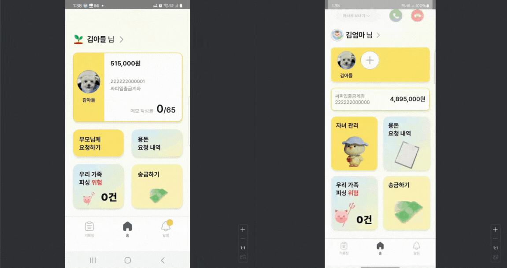

#### 스미싱 방지

- 문자 내 URL 자동 분석
- 악성 URL 감지 시 **경고 알림 전송** 및 클릭 차단 유도

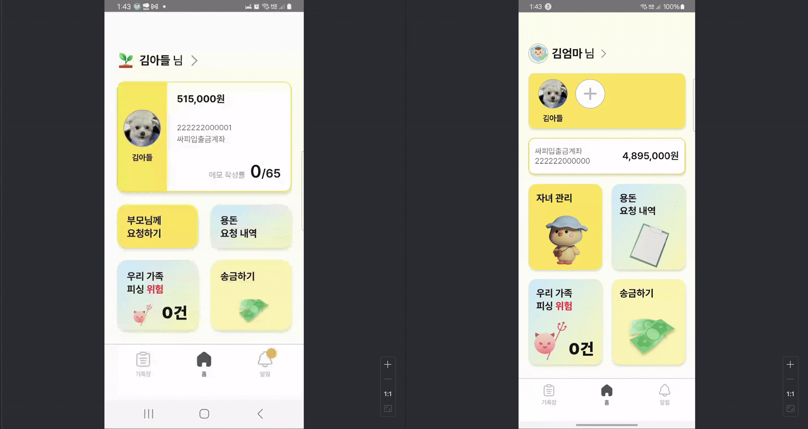

### 기능 3. 부모의 걱정 없는 금융 생활

- 자녀의 통화 및 문자 기반 **이상 행위 탐지 시스템** 구축
- AI가 실시간으로 위험을 분석하고 **가족에게 즉시 공유**
- **가족 단위의 디지털 보안 체계 구현**


## 아키텍처
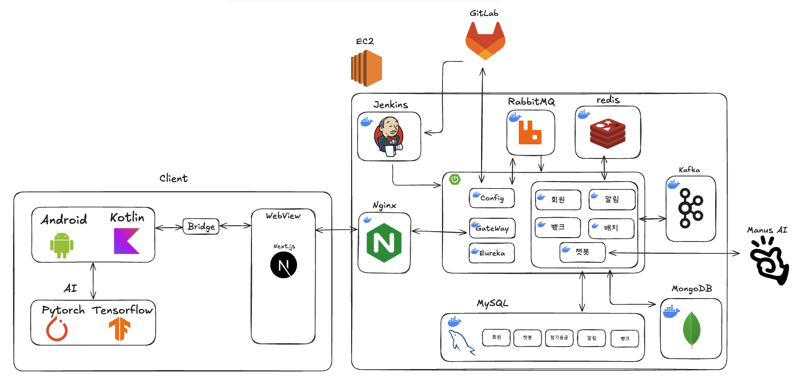

## ERD

### 비즈니스 서버
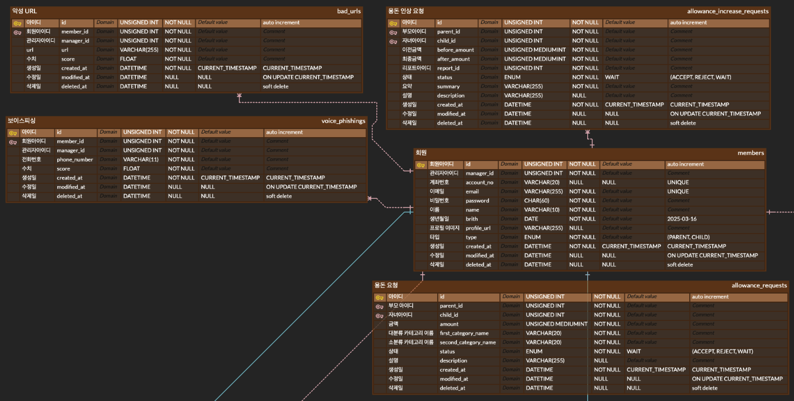

### 은행
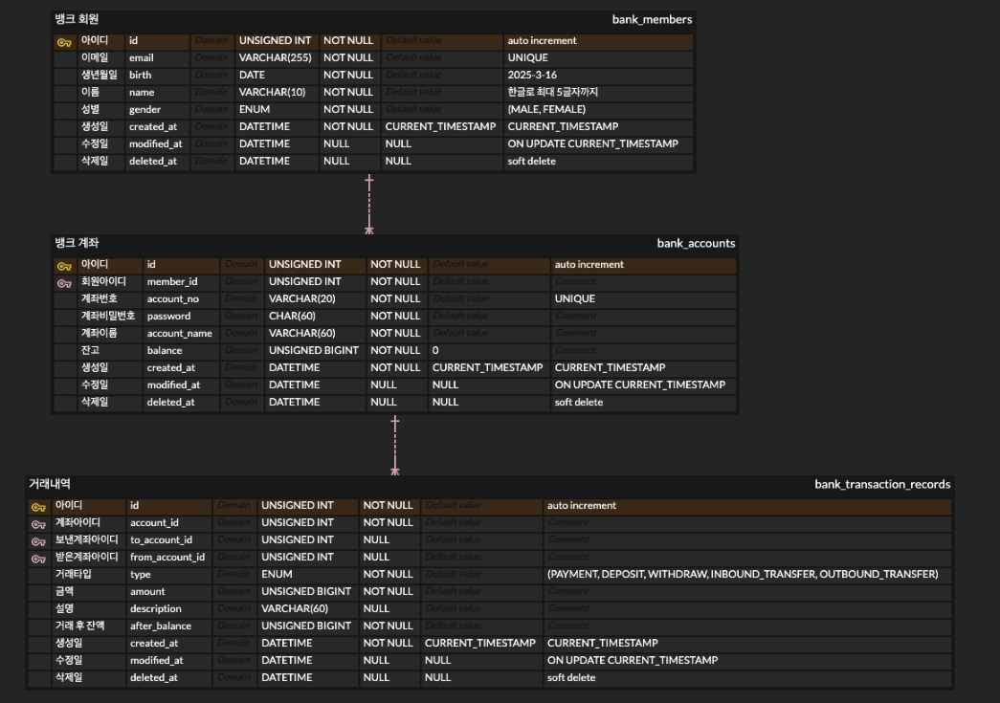

### 금전출납부
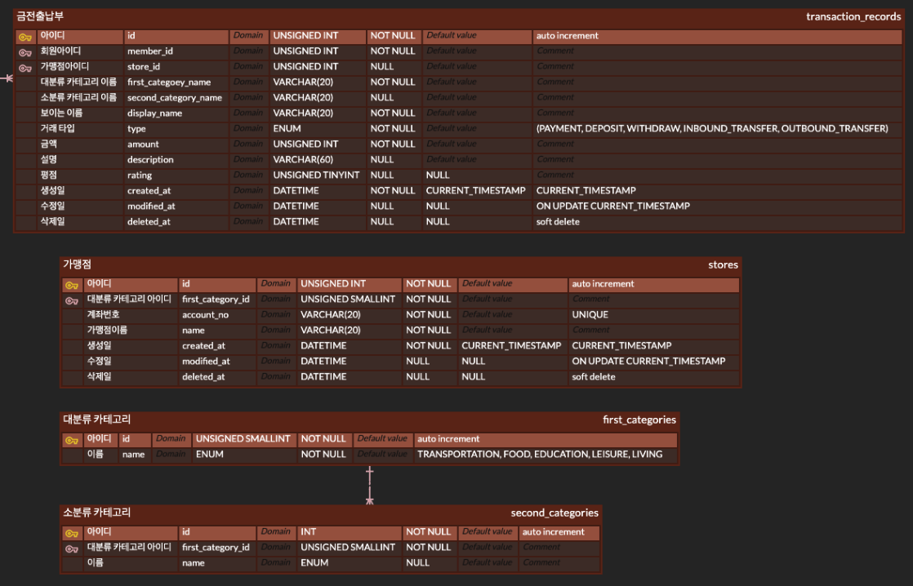

### 알림
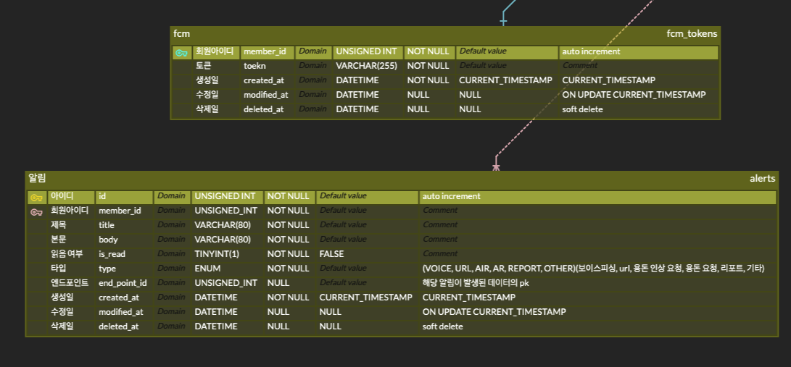

### AI
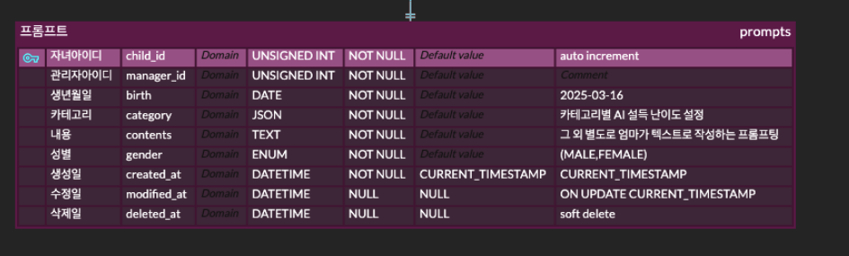

## 기술 스택

#### Back-End

<table border="0" style="border-collapse: collapse;">
  <tr>
    <td align="center" width="110" style="border: none;">
      <br/>
      <sub><b>Java 17</b></sub>
    </td>
    <td align="center" width="110" style="border: none;">
      <br/>
      <sub><b>Spring Boot 3.4.1</b></sub>
    </td>
    <td align="center" width="110" style="border: none;">
      <br/>
      <sub><b>Spring Data JPA</b></sub>
    </td>
    <td align="center" width="110" style="border: none;">
      <br/>
      <sub><b>Spring JDBC</b></sub>
    </td>
    <td align="center" width="110" style="border: none;">
      <br/>
      <sub><b>Spring Cloud</b></sub>
    </td>
  </tr>
  <tr>
    <td align="center" width="110" style="border: none;">
      <br/>
      <sub><b>Spring Security</b></sub>
    </td>
    <td align="center" width="110" style="border: none;">
      <br/>
      <sub><b>QueryDSL</b></sub></td>
    <td align="center" width="110" style="border: none;">
      <br>
      <sub><b>OAuth 2.0</b></sub></td>
    <td align="center" width="110" style="border: none;">
      <br>
      <sub><b>WebSocket</b></sub></td>
    <td align="center" width="110" style="border: none;">
      <br/>
      <sub><b>Kafka</b></sub>
    </td>
  </tr>
</table>

#### Front-End

<table border="0" style="border-collapse: collapse;">
  <tr>
    <td align="center" width="110" style="border: none;">
      <br/>
      <sub><b>React 19</b></sub>
    </td>
    <td align="center" width="110" style="border: none;">
      <br/>
      <sub><b>Next.js 15.2.4</b></sub>
    </td>
    <td align="center" width="110" style="border: none;">
      <br/>
      <sub><b>TypeScript 5</b></sub>
    </td>
    <td align="center" width="110" style="border: none;">
      <br/>
      <sub><b>Tailwind CSS 4</b></sub>
    </td>
    <td align="center" width="110" style="border: none;">
      <br/>
      <sub><b>Zustand 5.0.3</b></sub>
    </td>
  </tr>
  <tr>
    <td align="center" width="110" style="border: none;">
      <br/>
      <sub><b>Nginx</b></sub>
    </td>
  </tr>
</table>

#### Database / Cache

<table border="0" style="border-collapse: collapse;">
  <tr>
    <td align="center" width="110" style="border: none;">
      <br/>
      <sub><b>Redis</b></sub>
    </td>
    <td align="center" width="110" style="border: none;">
      <br/>
      <sub><b>MongoDB</b></sub>
    </td>
    <td align="center" width="110" style="border: none;">
      <br/>
      <sub><b>MySQL</b></sub>
    </td>
  </tr>
</table>

#### Infra / DevOps

<table border="0" style="border-collapse: collapse;">
  <tr>
    <td align="center" width="110" style="border: none;">
      <br/>
      <sub><b>Docker</b></sub>
    </td>
    <td align="center" width="110" style="border: none;">
      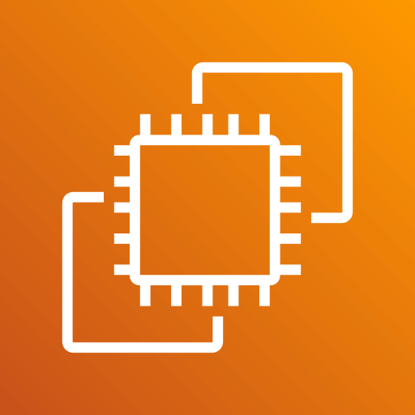<br/>
      <sub><b>AWS EC2</b></sub>
    </td>
    <td align="center" width="110" style="border: none;">
      <br/>
      <sub><b>AWS S3</b></sub>
    </td>
    <td align="center" width="110" style="border: none;">
      <br/>
      <sub><b>Jenkins</b></sub>
    </td>
  </tr>
</table>

## 주요 개발 기능 (담당)

### 1. FCM 기반 실시간 알림 시스템

#### 핵심 구현 Code

##### Firebase 설정 및 초기화
```java
@Configuration
public class FirebaseConfig {
    @Value("${firebase.config.path}")
    private String firebaseConfigPath;
    
    @PostConstruct
    public void initializeFirebase() {
        try {
            InputStream serviceAccount = new ClassPathResource(firebaseConfigPath).getInputStream();
            FirebaseOptions options = FirebaseOptions.builder()
                .setCredentials(GoogleCredentials.fromStream(serviceAccount))
                .build();
            
            if (FirebaseApp.getApps().isEmpty()) {
                FirebaseApp.initializeApp(options);
            }
        } catch (IOException e) {
            throw new RuntimeException("Firebase 초기화 실패", e);
        }
    }
}
```

##### FCM 메시지 전송 구현
```java
@Component
public class FCMNotificationSender implements NotificationSender {
    @Override
    public void send(String token, String title, String body) {
        Notification notification = Notification.builder()
            .setTitle(title)
            .setBody(body)
            .build();
            
        Message message = Message.builder()
            .setToken(token)
            .setNotification(notification)
            .build();
            
        try {
            FirebaseMessaging.getInstance().send(message);
        } catch (FirebaseMessagingException e) {
            throw new FCMException(FCM_SEND_FAILED);
        }
    }
}
```

##### 안정적인 알림 전송 로직
```java
@KafkaListener(topics = "alarm", groupId = "alarm-group")
public void onMessage(AlarmEventMessage message, Acknowledgment ack) {
    try {
        // 1. DB에 알림 저장 (성공/실패 무관하게 기록)
        alarmService.saveAlarm(message);
        
        // 2. FCM 토큰 조회 및 전송
        String token = fcmTokenService.getFCMToken(message.memberId());
        notificationSender.send(token, message.title(), message.body());
        ack.acknowledge();
        
    } catch (FCMException e) {
        // 3. FCM 전송 실패 시 Retry Topic으로 재시도 요청
        producer.sendRetryMessage(AlarmRetryEventMessage.from(message, token));
        ack.acknowledge(); // 메시지는 처리 완료로 표시
    }
}
```

##### Retry 메커니즘
```java
@KafkaListener(topics = "alarm-retry", groupId = "alarm-retry-group")
public void onRetryMessage(AlarmRetryEventMessage message, Acknowledgment ack) {
    if (message.retryCount() >= MAX_RETRY_COUNT) {
        log.error("[최대 재시도 초과] token={}, retryCount={}", message.token(), message.retryCount());
        return;
    }
    
    try {
        notificationSender.send(message.token(), message.title(), message.body());
    } catch (FCMException e) {
        // 재시도 카운트 증가 후 다시 Retry Topic으로 전송
        retryEventProducer.sendRetryMessage(message);
    }
}
```

##### 주요 기능 및 강점
- **Kafka 기반 이벤트 공통화**: 모든 알림을 Kafka 토픽으로 통합 관리
- **Retry Topic 패턴**: FCM 전송 실패 시 자동 재시도 (최대 3회)
- **장애 격리**: 알림 저장과 FCM 전송을 분리하여 시스템 안정성 보장
- **비동기 처리**: Kafka Consumer를 통한 논블로킹 알림 처리

---

### 2. CI/CD 파이프라인 구축

#### GitLab + Jenkins + AWS EC2 기반 자동 배포

##### 파이프라인 구조
1. **GitLab Repository** → 소스 코드 및 설정 파일 관리
2. **Jenkins** → 빌드, 테스트, 배포 자동화
3. **AWS EC2** → 운영 서버 환경

##### Web Server Jenkins Script
```bash
pipeline {
    agent any

    stages {
        stage('Checkout') {
            steps {
                git branch: 'FE-prod',
                    url: 'https://lab.ssafy.com/s12-fintech-finance-sub1/S12P21A603.git',
                    credentialsId: 'gitlab-credential'
            }
        }

        stage('Build & Deploy FE') {
            steps {
                dir('front-end') {
                    sh 'docker compose -f docker-compose.yml down -v'
                    sh 'docker compose -f docker-compose.yml up -d --build'
                }
            }
        }
    }
}
```

##### WAS Jenkins Script
```bash
pipeline {
    agent any

    environment {
        AWS_DEFAULT_REGION = 'ap-northeast-2'
        S3_BUCKET          = 'aicheck-webserver-bucket'
        CF_DISTRIBUTION_ID = 'E3MSSLW1SEOF06'
        HOST_ENV_PATH      = '/home/ubuntu/aicheck/env/.env'
        MYSQL_INIT_PATH    = '/home/ubuntu/aicheck/db/mysql'
        MONGO_INIT_PATH    = '/home/ubuntu/aicheck/db/mongo'
        FIREBASE_PATH      = '/var/jenkins_home/external-secrets/serviceAccountKey.json'
    }

    stages {
        stage('Checkout') {
            steps {
                git branch: 'BE-prod',
                    url: 'https://lab.ssafy.com/s12-fintech-finance-sub1/S12P21A603.git',
                    credentialsId: 'gitlab-credential'
            }
        }

        stage('Prepare ENV & DB Scripts') {
            steps {
                sh '''
                    cp $HOST_ENV_PATH back-end/.env
        
                    mkdir -p back-end/db/mysql
                    cp /home/ubuntu/aicheck/db/mysql/* back-end/db/mysql/
                    chmod +x back-end/db/mysql/00_init.sh
        
                    mkdir -p back-end/db/mongo
                    cp /home/ubuntu/aicheck/db/mongo/* back-end/db/mongo/
                '''
            }
        }

        stage('Patch Docker Compose Path') {
            steps {
                sh '''
                    sed -i.bak "s|\\./db/mysql:/docker-entrypoint-initdb.d|$MYSQL_INIT_PATH:/docker-entrypoint-initdb.d|" back-end/docker-compose.yml
                    sed -i.bak "s|\\./db/mongo/init-mongo.sh:/docker-entrypoint-initdb.d/init-mongo.sh:ro|$MONGO_INIT_PATH/init-mongo.sh:/docker-entrypoint-initdb.d/init-mongo.sh:ro|" back-end/docker-compose.yml
                '''
            }
        }
        
        stage('Copy Firebase Secret to Alarm') {
            steps {
                sh '''
                    cp $FIREBASE_PATH back-end/alarm/src/main/resources/serviceAccountKey.json
                '''
            }
        }

        stage('Deploy Back-End') {
            steps {
                dir('back-end') {
                    sh '''
                        docker compose down
                        docker compose --env-file .env up -d --build
                    '''
                }
            }
        }

        stage('Restore Docker Compose Path') {
            steps {
                sh '''
                    mv back-end/docker-compose.yml.bak back-end/docker-compose.yml
                '''
            }
        }
    }
}
```

##### 주요 특징
- **브랜치별 자동 배포**: BE-prod 브랜치 push 시 자동 빌드 및 배포
- **Docker 컨테이너 기반**: 일관된 배포 환경 보장

### 3. Chatbot 서버 구현

#### 핵심 구현 Code

##### 챗봇 서비스
```java
@Service
public class ChatbotServiceImpl implements ChatbotService {
    private final PromptService promptService;
    private final RedisService redisService;
    private final AIService aiService;
    private final AlarmEventProducer alarmEventProducer;
    
    @Override
    public PersuadeChatResponse sendPersuadeChat(Long childId, String message) {
        // 1. 사용자 맞춤 설정 로드
        CustomSetting customSetting = redisService.loadCustomSetting(childId);
        
        // 2. 대화 이력 조회
        List<ChatNode> chatHistories = redisService.loadChatHistory(childId, PERSUADE);
        
        // 3. AI 서버와 통신
        PersuadeResponse persuadeResponse = aiService.sendPersuadeChat(customSetting, chatHistories, message);
        
        // 4. 설득 성공 시 부모에게 알림
        if (persuadeResponse.isPersuaded()) {
            Long managerId = promptService.getPrompt(childId).managerId();
            alarmEventProducer.sendEvent(AlarmEventMessage.of(managerId, 
                persuadeResponse.result().title(), 
                persuadeResponse.result().description()));
            endChat(childId, PERSUADE);
        }
        
        return PersuadeChatResponse.from(persuadeResponse);
    }
}
```

##### 핵심 강점 및 기술적 특징

###### 1. 컨텍스트 기반 개인화 AI 시스템
```java
public void startChat(Long childId, ChatType chatType) {
    // 사용자별 맞춤 정보를 실시간으로 수집하여 AI 컨텍스트 구성
    PromptInfo promptInfo = promptService.getPrompt(childId);           // 부모 설정값
    ScheduledAllowance scheduledAllowance = batchFeignClient.getScheduledAllowance(childId); // 용돈 정보
    TransactionInfoResponse transactionInfo = businessFeignClient.getTransactionInfo(childId); // 거래 내역
    
    // Redis에 개인화된 대화 설정 저장
    CustomSetting setting = CustomSetting.from(
        CustomSettingRequest.from(promptInfo, scheduledAllowance, transactionInfo)
    );
    redisService.prepareChatSession(childId, chatType, setting);
}
```

###### 2. Redis 기반 실시간 대화 세션 관리
```java
public void appendChatHistory(Long childId, ChatType chatType, AIMessage aiMessage, MemberMessage memberMessage) {
    String key = historyKey(chatType, childId);
    // List 자료구조로 대화 순서 보장
    chatNodeRedisTemplate.opsForList().rightPush(key, ChatNode.from(memberMessage));
    chatNodeRedisTemplate.opsForList().rightPush(key, ChatNode.from(aiMessage));
}

// 타입별/사용자별 세션 분리: "chat:history:PERSUADE:123"
private String historyKey(ChatType chatType, Long childId) {
    return HISTORY_KEY_PREFIX + chatType.name() + ":" + childId;
}
```

###### 3. 다중 마이크로서비스 연동을 통한 데이터 통합
- **Business Service**: 거래 내역, 용돈 요청 저장
- **Batch Service**: 정기 용돈 정보 조회  
- **Alarm Service**: 협상 성공 시 부모 알림
- **AI Service**: FastAPI 기반 자연어 처리

###### 4. 장애 격리 및 안정성
```java
try {
    scheduledAllowance = batchFeignClient.getScheduledAllowance(childId);
    transactionInfo = businessFeignClient.getTransactionInfo(childId, startDate, interval);
} catch (Exception e) {
    // 외부 서비스 장애 시에도 기본 기능 동작 보장
    scheduledAllowance = null;
    transactionInfo = null;
}
```

##### 주요 기능
1. **실시간 개인화**: 사용자별 거래내역, 용돈정보 기반 맞춤형 AI 응답
2. **멀티 채팅 타입**: 협상(PERSUADE)과 상담(QUESTION) 채팅 분리 관리
3. **상태 유지**: Redis 세션을 통한 대화 컨텍스트 보존
4. **이벤트 드리븐**: 협상 성공 시 자동 알림 및 용돈 요청 생성
5. **장애 허용**: 의존 서비스 장애 시에도 기본 기능 제공

## 팀원

| 조예슬 | 이시우 | 유선우 | 이승우 | 이정현 |
| :----: | :----: | :----: | :----: | :----: |
|  |  |  |  |  |
| **AI** | **AI** | **BE** | **BE** | **FE** |
| [@seul1230](https://github.com/seul1230) | [@LEE-SIU](https://github.com/LEE-SIU) | [@BrokenFinger98](https://github.com/BrokenFinger98) | [@swoolee97](https://github.com/swoolee97) | [@junghyunl](https://github.com/junghyunl) |